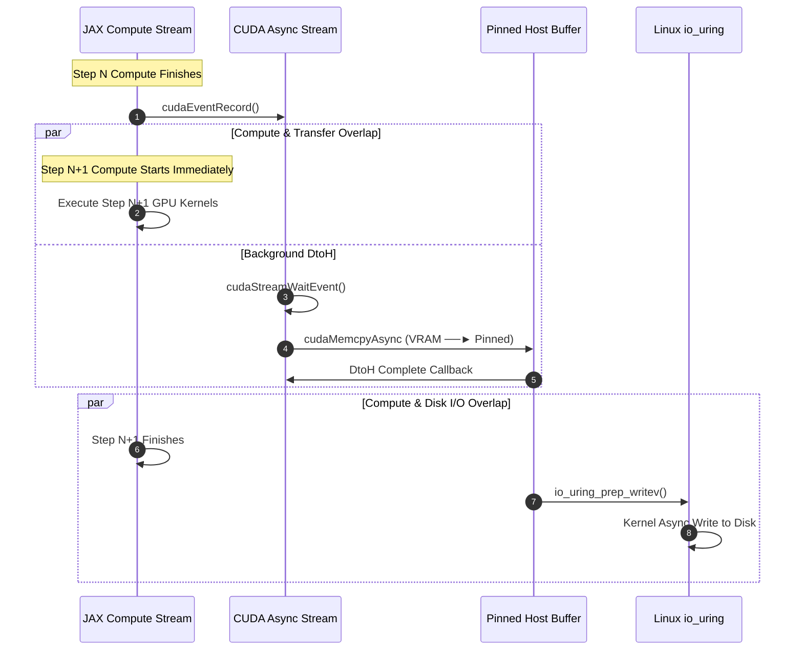
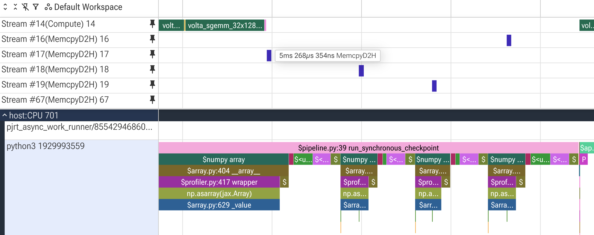
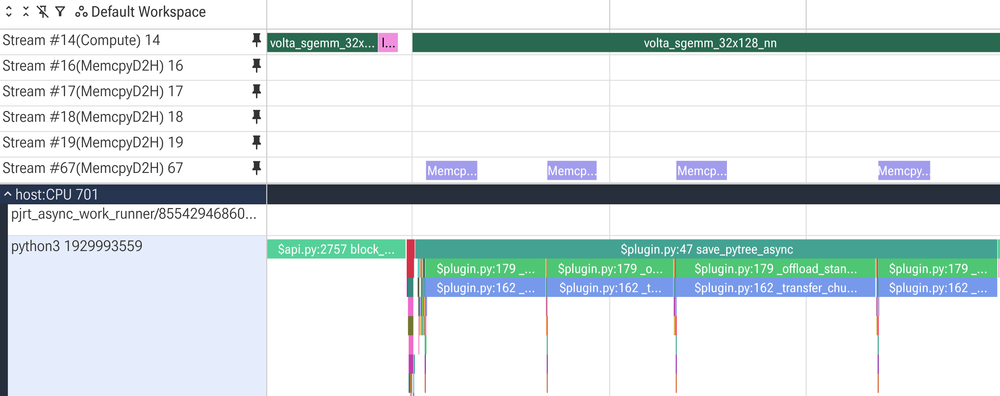

# JAX Async Checkpointer (`jax-async-ckpt`)

An ultra-high-performance, asynchronous checkpointing engine designed for large-scale distributed JAX workloads in HPC environments.

By combining high-level Python workflow management with a lightweight C++20/CUDA native core, `jax-async-ckpt` eliminates checkpointing bottlenecks during model training.

---

## 🎯 Primary Objective

Traditional checkpointing blocks main compute execution threads while state tensors are serialized and transferred over host memory to disk storage.

`jax-async-ckpt` decouples checkpoint I/O from the JAX execution stream. It enables training loops to resume computation immediately after kicking off non-blocking device-to-host memory transfers, while a background C++ core handles storage flushing via Linux direct I/O. For restoration, it streams binary files directly back through host-pinned staging memory directly onto GPU buffers without blocking PyTree reconstruction.

---

## 🔑 Key Features & Architecture

* **Bidirectional Async Pipeline**: Full support for both non-blocking **save** (`GPU -> Host -> NVMe`) and **restore** (`NVMe -> Host -> GPU`) operations.
* **Zero-Blocking Execution Overhead**: Hands off GPU tensor buffers asynchronously via dedicated non-blocking CUDA streams (`cudaStreamNonBlocking`), freeing JAX step iteration loops.
* **Linux `io_uring` Kernel Direct I/O**: Direct Kernel Ring Submission (SQ/CQ) bypasses standard POSIX filesystem locking overhead, writing pinned host memory slices directly to NVMe/parallel filesystems.
* **Double-Buffered Memory Pipelining**: Features ping-pong host-pinned memory management (`cudaHostAlloc`) to overlap compute steps with background disk flushes and loads.
* **Zero-Copy Native Bindings**: Low-overhead C++/Python interoperability provided by `nanobind`, extracting raw JAX array pointers through native buffer interfaces (`PjRtBuffer` / `unsafe_buffer_pointer`).

---

## 🏗️ Execution Flow



---

## 🚀 Quickstart

### Environment Setup

Before building `jax-async-ckpt` from source, ensure your host system or HPC cluster environment meets the core C++20, CUDA 13, and system library requirements.

#### System Dependencies

Building the non-blocking C++ engine requires the following base environment specs:

* **Compiler:** `GCC >= 13` (required for modern C++20 features)
* **CUDA Toolkit:** `CUDA >= 12`
* **Linux Async I/O:** `liburing` (kernel development headers and userland libraries)
* **MPI:** `OpenMPI` (or an equivalent MPI implementation)
* **Build System:** `CMake >= 3.22`

#### Install the package via pip

To link against locally exposed CUDA, follow [JAX documentation](https://docs.jax.dev/en/latest/installation.html#pip-installation-nvidia-gpu-cuda-installed-locally-harder).

```

# Basic installation with prebuilt CUDA and MPI wheels
pip install .

# To link against existing CUDA and MPI
MPICC=$(which mpicc) pip install --no-binary mpi4py jax[cuda13-local] .
```

#### `uv` Installations

If `just` is not available, simply run the commands manually from the `justfile`.

```bash
# Ensure .env variables are set
just sync
```

### Build & Test Workspace

Compile the native C++ extension module in editable mode and run the test suite:

```bash
# Build C++ shared library into workspace
just build

# Run unit and integration tests (Basic, Distributed MPI, Restore)
just test
```

### Benchmark against Synchronous Checkpointing

```bash
uv run python3 benchmarks/pipeline.py \
    --param-dim 4096 --num-params 8 --num-steps 20 \
    --ckpt-interval 5 --max-buffer-mb 1024 \
    --checkpoint-dir ./tmp --warmup-steps 2
```

```bash
=== Running Scaling Benchmark across 1 MPI Ranks ===
Matrix Dimension: 4096 x 4096 | Tensors per Rank: 8
Model Size per Rank: 512.00 MB | Total System Data: 0.50 GB
=== Benchmark Results ===
Avg Step Time (Sync):  399.92 ms
Avg Step Time (Async): 380.02 ms
-----------------------------------
Checkpoint Step Time (Sync):  688.38 ms
Checkpoint Step Time (Async): 372.54 ms
Compute Stall Reduction:       45.88%
```

#### Profiler view

##### Synchronous Transfers



XLA sequentially dispatches tensor copies across *4 internal runtime streams* one after another. A host barrier freezes the main GPU execution stream, creating a large compute idle gap.

##### Asynchronous Transfers


All tensor transfers are queued onto a *single dedicated background CUDA stream*. Compute Step $N+1$ runs concurrently on the main GPU stream without waiting for background transfers to complete.

---

## 💡 Usage Example

### Save and Restore Round-Trip

```python
import jax
import jax.numpy as jnp
from mpi4py import MPI
from jax_async_ckpt.plugin import JaxAsyncCheckpointer

comm = MPI.COMM_WORLD

# Initialize checkpointer with max staging capacity (e.g., 4 GB)
checkpointer = JaxAsyncCheckpointer(max_buffer_bytes=4 * 1024 * 1024 * 1024, comm=comm)

# 1. Model State PyTree
state = {
    "params": {"w": jnp.ones((8192, 8192), dtype=jnp.float32)},
    "opt_state": {"m": jnp.zeros((8192, 8192), dtype=jnp.float32)},
}

base_path = "/mnt/nvme/checkpoint_step_100"
manifest_path = f"{base_path}_manifest.json"

# 2. Async Save (Non-blocking: control returns immediately)
checkpointer.save_pytree_async(state, base_filepath=base_path)

# Training loop continues computation uninterrupted ...

# Synchronize host and drain CQE write queues prior to teardown/fences
checkpointer.wait_all()

# 3. Async Restore
# Restores GPU arrays asynchronously and re-hydrates the original PyTree structure
restored_state = checkpointer.restore_pytree_async(manifest_path)
checkpointer.wait_all()
```